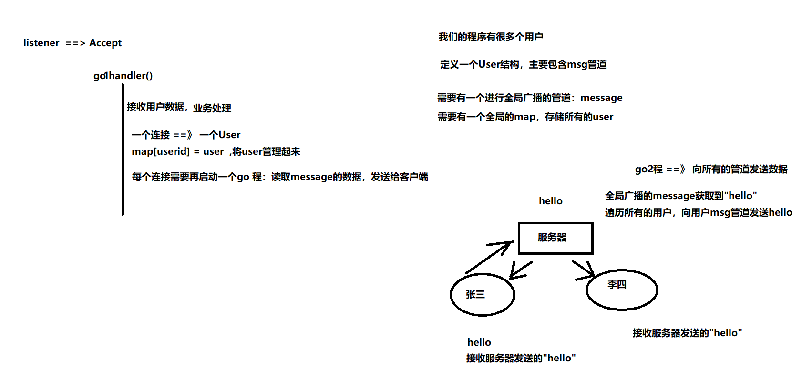
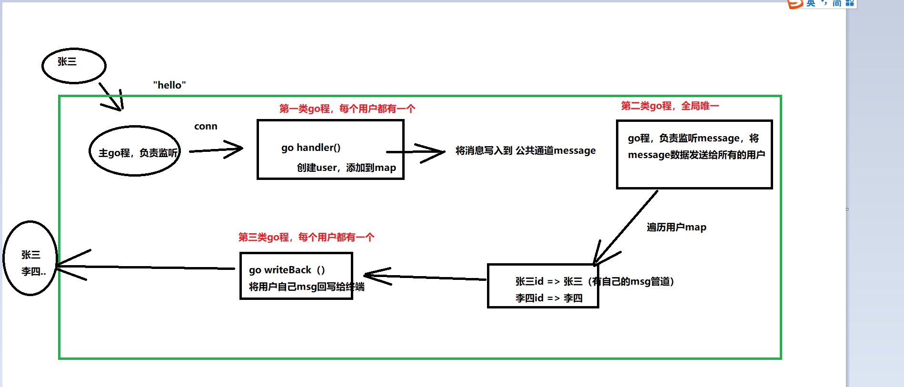

# 一、概述

实现一个网络聊天室（群），

功能分析：

1. 上线下线
2. 聊天，其他人、自己都可以看到聊天消息
3. 查询当前聊天室用户名字 who
4. 可以修改自己名字rename|Duke
5. 超时踢出

# 二、实现基础



数据流向：



------

（第二次提交）

## 1、tcp socket，建立多个连接

```go
package main

import (
	"fmt"
	"net"
)

//将所有的代码写在一个文件中，不做代码整理

func main() {
	//创建服务器
	listener, err := net.Listen("tcp", ":8080")
	if err != nil {
		fmt.Println("net.Listen err:", err)
		return
	}
	fmt.Println("服务器启动成功!")

	for {
		fmt.Println("=====> 主go程监听中...")

		//监听
		conn, err := listener.Accept()
		if err != nil {
			fmt.Println("listener.Accept err:", err)
			return
		}

		//建立连接
		fmt.Println("建立连接成功!")

		//启动处理业务的go程
		go handler(conn)
	}
}

//处理具体业务
func handler(conn net.Conn) {
	for {
		fmt.Println("启动业务...")
		//TODO  //代码这里以后再具体实现，当前保留
		buf := make([]byte, 1024)

		//读取客户端发送过来的请求数据
		cnt, err := conn.Read(buf)
		if err != nil {
			fmt.Println("conn.Read err:", err)
			return
		}

		fmt.Println("服务器接收客户端发送过来的数据为: ", string(buf[:cnt-1]), ", cnt:", cnt)
	}
}
```


## 2、定义user，以及存放user的map

```go
type User struct {
   //名字
   name string
   //唯一id
   id string
   //管道
   msg chan string
}

//建立全局map结构，用于保存所有用户
var allUsers = make(map[string]User)
```

## 3、在handler中，建立连接时就创建user,并初始化属性后，将其创建的消息写入公共管道之中

```go
for  {
   fmt.Println("启动业务")

   newUser := User{
      name: clientAddr,//后续会修改，初始值与id相同
      id: clientAddr,
      msg: make(chan string),
   }
   //添加User到map
   allUsers[newUser.id] = newUser

   //向message写入数据,当用户上线的时，将消息通知所有人
   loginInfo := fmt.Sprintf("[%s]:[%s]=====>上线啦",newUser.id,newUser.name)
   message <- loginInfo
```

